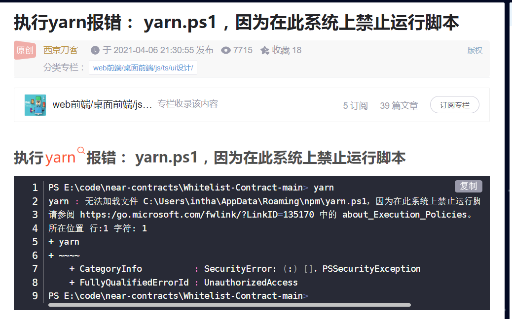

# 从0开始的项目搭建

## 第一步： 项目搭建


## 第二步 ：初始化 store 和 redux

```js
// userReducer:
// userReducers里用到的type 形如 export const SET_USER_TOKEN = "SET_USER_TOKEN";
import * as types from '../actionTypes';

const initUserInfo = {
    data:{},
    isLogined: false
}

export default function userReducer(state = initUserInfo, action){
    switch(action.type){
        case types.SET_USER_TOKEN:
            return {
                ...state,
                data: action.data,
                isLogined: true
            }
            
           ....
           
    }
}
```

```js
// 参考上面代码块  
// teacherReducer
export default function teacherReducer(state, action){
    switch(action.type){
        case ''
        	return {
                ...state,
                ...
        	}
    }
}
```


```js
// combineReducer.js
import { combineReducers } from 'redux';
import userReducer from './userReducer';
import teacherReducer from './teacherReducer';

const reducers = combineReducers({user:userReducer, teacher: teacherReducer });
export default reducers;

/*
	combineReducer(reducers)
	通过对 combineReducers 的源码分析，combineReducers() 接收一个对象，它的值对应不同的 reducer 	函数，这些reducer 函数会被合并为一个。
	 const finalReducers = {} // finalReducers (最终合并生成的的reducers)
	 if (typeof reducers[key] === 'function') {
      finalReducers[key] = reducers[key]
    }
*/
```

**store.js**

```js
// persistReducer 
// function persistReducer(cfg, reducer) {
//    ...
//   return (state, reducer){
//        ....
//    }
//}
import reducer from './combineReducer';
import { createStore, applyMiddleware  } from ' redux';
import { persistReducer, persistStore } from 'redux-persist'
import thunk from 'redux-thunk';
import storage from 'redux-persist/lib/storage';
import autoMergeLevel2 from 'redux-persist/lib/stateReconciler/autoMergeLevel2';

const persistConfig = {
  key: 'root',
  storage: storage,
  stateReconciler: autoMergeLevel2
}
const myPersistReducer = persistReducer(persistConfig, reducer)
*************持久化reducer创建完成*****************
// 创建store
 const store = createStore(myPersistReducer,  applyMiddleware(thunk),);
// 创建并导出 persistStore
export const persistor = persistStore(store);
// 导出 store
export default store;
```

**index.tsx**

```tsx
import * as React from 'react';
import ReactDOM from 'react-dom';
import { Provider } from 'react-redux';
import { PersistGate } from 'redux-persist/lib/integration/react';
import store ,{ persistor } from './store';
import APP from './APP'


// react-redux 通过 Provider 把数据传递给 react 子组件
ReactDOM.render(
  <Provider store={ store }>
    <PersistGate persistor={ persistor }>
      <App />
    </PersistGate>
  </Provider>,
  document.getElementById('root')
);
```

## 第三步： 路由

**src/router/config.tsx**

```tsx
import Login from "@/views/Login";
import Home from "@/views/Home";
import NotFound from "@/components/404";
import { RouteObject, useRoutes } from 'react-router-dom'
import React from "react";

const routerCfg: RouteObject[] = [
  {
    path: '/',
    element: <Home />,
  },
  {
    path: '/login',
    element: <Login />
  },
  {
    path: '/404',
    element: <NotFound />,
  },
]

const Router = () => {
  let element = useRoutes(routerCfg);
  return element;
}

export default Router;
```

```tsx
import * as React from 'react';
import { BrowserRouter } from "react-router-dom";
import Router from './router/config';


function App() {
    return (
      <BrowserRouter>
        <Router />
      </BrowserRouter>
    )
}

export default App;
```

https://github.com/linxianxi/react-router-auth-plus/blob/master/lib/utils.tsx

https://juejin.cn/post/7071086182116884487 基于v6 路由权限控制

### 问题总结

在react-router-dom6 上遇到问题较多，一是因为之前未独立进行过配置式路由从0到1的开发，2是v6版本的useRoutes() 从未用过。遇到的问题如下：

1 在用useRoutes报错 常识性错误，钩子只能用在组件里，不能用在函数里。


2 类型错误 （暂未解决） 联合类型不能被接口继承


3 由于引入redux-thunk中间件，dispatch问题

**请去阅读源码！！**

  https://www.zhihu.com/search?type=content&q=reducx-thunk%20dispatch


4 TS中 .ts 和.d.ts的区别

**5 // todo useSelector 和 useDispatch 的使用 以及与store.getState() ;store.dispatch()** 

6 react-router-v6 outlet 和 layout 布局路由 可参考

https://blog.csdn.net/ImagineCode/article/details/124726400

7 无法解析.ts文件 webpack配置里面 没有加.ts

8 ahooks 源码解读 https://juejin.cn/post/7000926273308475422

9 从0 搭建 https://juejin.cn/post/7058173550879834125#heading-30

10 执行yarn 报错 

https://docker.blog.csdn.net/article/details/115471596?spm=1001.2101.3001.6661.1&utm_medium=distribute.pc_relevant_t0.none-task-blog-2%7Edefault%7ECTRLIST%7ERate-1-115471596-blog-124603200.pc_relevant_landingrelevant&depth_1-utm_source=distribute.pc_relevant_t0.none-task-blog-2%7Edefault%7ECTRLIST%7ERate-1-115471596-blog-124603200.pc_relevant_landingrelevant&utm_relevant_index=1



11 可参考学习的另一篇文档 关于react-router-v6的

https://juejin.cn/post/7079778169581994021

12 另一片权限控制的文章

https://juejin.cn/post/7071086182116884487

关于权限问题的一点收获：**

1 我认为最好的方式是  用户—角色—权限的方式。

可以在配置路由时，扩展RouteObject类型，添加meta配置项，在配置项里可以添加一个role列表，代表什么角色可以访问，添加unrole列表代表什么角色不能访问，可以添加一个auth属性，代表是否需要登录验证。这样用户和角色挂钩， 而我们只需要关注角色对应的路由权限即可。


2023年1月29日16:31:02

less 的导入问题

import  style from './style.module.less';

import './style.less'

解决博客： https://blog.csdn.net/akjyuanfang123/article/details/120254919

可进一步优化的参考： https://blog.csdn.net/Ws_zqw/article/details/122167820

2023年1月30日12:38:36

其他软件网络连接正常 ，浏览器无法连接网络问题 解决途径： https://www.bilibili.com/video/BV1Tf4y167tg/

2023年1月31日16:02:36

2023年1月31日19:39:44

2023年1月31日21:38:49

​	狂飙第37集 ，洗漱，上楼，打开电脑。

immer: produce

https://zhuanlan.zhihu.com/p/360242077

**总结**

第一个连滚带爬从0搭建的项目框架。

1 使用了 redux react-redux redux-thunk redux-persist对这些有了一个初步的认识。

2 对react-router v6多了一些如何使用的了解。最重要的是对如何进行角色权限控制及发送网络请求时进行token认证是如何做的（使用redux-persist 做用户数据持久化，token存在其中，发送请求时将token放在请求头中）。

3 对customize-cra 了解了一下，但是一般项目使用webpack 进行打包配置，使用config-overrides配置参考资料较少。

**4 以上代码片段皆为最初版，全是问题。仅为以后查阅时做对比参照 **

**5** **至此OVER 。历时7天。**

**项目github地址： https://github.com/xmy1011/xmy1011.github.io/tree/main/react-ts-antd ** 

2023年1月31日23:29:55