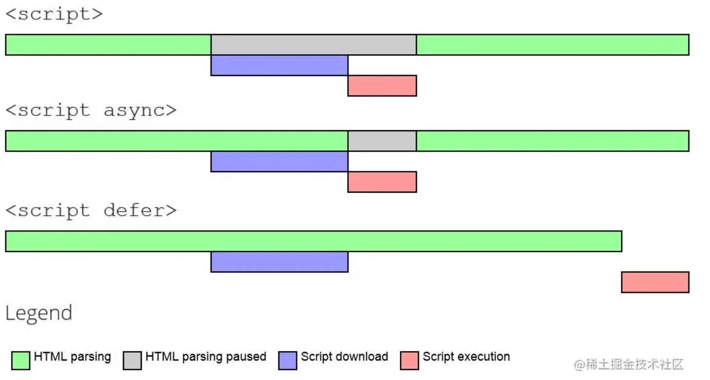

### 1 如何理解 HTML 语义化？

- 增加代码可读性，让人更容易读懂
- 在没有 css  样式下， 页面也能呈现出很好的内容结构，代码结构
- 让搜索引擎更容易读懂，有助于爬虫抓取更多的有效信息，爬虫依赖于标签来确定上下文和各个关键字的权重。（SEO）

### 2 script 标签中，defer 和 async 的区别

- `script` :  会阻碍 HTML 的解析，只有下载好并执行完脚本才会继续解析 HTML。
- `async script`:  解析 HTML 过程中，进行脚本的 异步加载，下载完成后会立马执行，有可能会阻断 HTML 的解析
- `defer script`:  完全不会阻碍 HTML 的解析，HTML 解析完成后，再按照瞬息执行脚本。



### 3 什么是 XSS 攻击？

XSS攻击是跨站脚本（Cross Site Scripting）攻击。为了与CSS 区别，叫做 XSS；

是指 恶意用户 在 html 中注入 含恶意的 JS 代码或者 HTML 代码。其他用户浏览该页面的时候，浏览器会直接编译处理所有代码包括恶意攻击代码，从而损害用户利益。

XSS 攻击的分类：

**1 存储型 XSS 攻击**

- 1 用户把恶意代码片段提交到服务器的数据库中
- 2 普通用户请求网站，网站把包含恶意代码的数据从页面中加载出来
- 3 恶意代码运行

**2 反射型 XSS 攻击**

**3 Dom 型 XSS 攻击**

DOM型 XSS攻击和 反射型 XSS类似，都是用过 **把恶意代码 作为参数**放到 URL 中，诱发用户点击。不过区别在于，反射型 XSS 攻击的页面是通过后端的模板引擎渲染的，而 DOM型 XSS 攻击中的页面是通过前端取出URL 中的参数里的恶意代码后，然后通过 document.write或者 innerHTML 等方法渲染到页面上的。

**总结：**

一般的XSS 攻击中注入的恶意代码有两种类型

1 在 img 或者 iframe 标签中，后面接着代码，可能以 javascript : 开头

2 以<script>标签包裹着代码。

##### 预防：

1 关键字转义 < > "" 最好在后端进行，有缺点，不能避免 javascript：开头的代码，如果前端需要对数据进行处理，需要将特殊字符转义回原来的格式。

2 长度限制 前后端都要对提交信息进行校验，一般 XSS 嵌入的恶意代码无论是那种类型，都需要相当的长度才可以。甚者可以把代码再拆分成好几段字符串，然后最后拼起来用eval运行。但仍然可以增加XSS攻击的难度。

3 Content Security Policy 白名单制度

我们可以通过两种方式开启 CSP

- 1 后端配置响应头 

```js
//中间件配置csp
function csp(req,res,next){
    res.header('Content-Security-Policy',"default-src 'self';script-src 'self'")
    next()
}
app.use(csp)
```

- 2 在网页的 head设置 meta 标签

```js
<meta http-equiv="Content-Security-Policy" content="default-src 'self' ;">
```

4 设置 cookie 的 httpOnly 属性，浏览器的cookie 不能通过js脚本获取，保护 cookie


