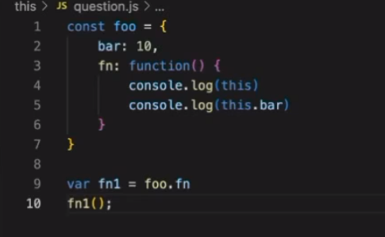
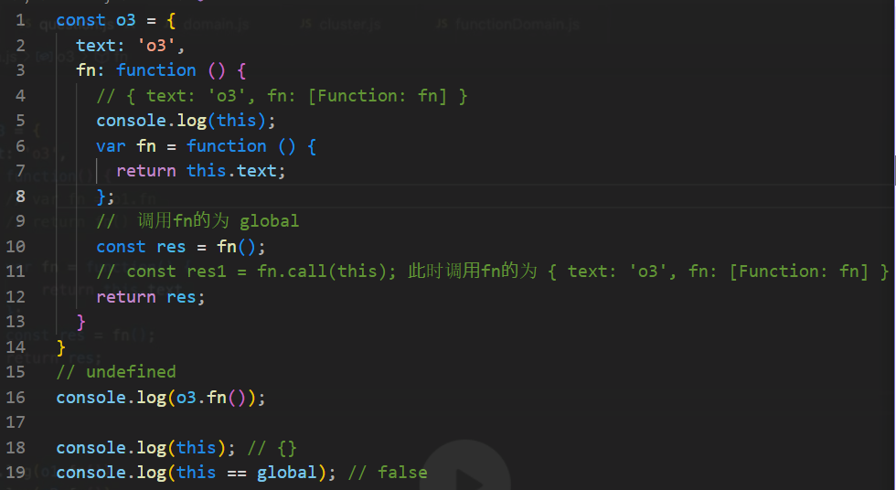
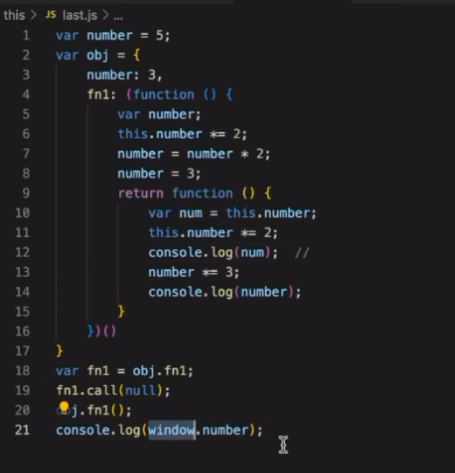

# 第一节课 this/ 闭包

###  本节课重点：

####  1 this 的指向问题

#### 2 由作用域上下文等引出的闭包问题

#### 3 更改this 指向 ， 手写bind call 方法

JS 只有函数级的作用域


## this

#### 程序是怎么运行的

传统来说 编译是一件很复杂的事情；

1 先进行分词

2 构建抽象语法树（AST）

​	词法分析 语法分析

 	从抽象语法树中能反推出来这句话的意思。

3 代码生成

### 对JS来说 主要分为两个阶段

—— 预编译 阶段 由 编译器 将 JS  编译 成可执行的代码

JS是个解释型语言  编译一行 执行一行

在代码执行前  JS 会做一些预先准备的工作：

​	—— 变量声明 

​	—— 变量提升 但其值是 undefined

​	 ——所有非表达式的函数声明 进行提升

—— 代码执行阶段

### 作用域

> 作用域，就是根据名称，去查找变量的规则。

#### 词法作用域 / 静态作用域。

词法作用域，就是定义在，词法阶段的作用域。

#### 动态作用域 / 上下文。

在运行时的作用域。

### 什么情况下 我的 上下文 和 作用域 不一致： 闭包


###  上下文如何确定？ ——通过this指针

   this 指向什么？ this的指向是根据我的执行上下文 动态决定的.

​	（1）this 默认指向  global / undefined / window

​	（2） 在对象调用时 ，绑定在对象上

​	（3） 在使用 call / apply / bind 时。 绑定到指定的参数上；

​	（4） 使用 new 关键字，绑定到新创建的对象上

​	（优先级： new > apply/call / bind > 对象调用）

​	（5） 使用箭头函数，根据外层的规则确定



​					global 调用的 fn1； fn1  中的 this 指向global 

​					this： global 

​					this.bar: undefined





### 闭包

::  通常来说 闭包是一个函数A返回了另一个函数B。但我理解真正的原因是 被返回的函数B可能在别的地方执行，造成了 执行的作用域 和 定义的作用域不一致。若是函数B中用到了A中的变量，可能会导致变量无法回收，造成内存泄露。 但闭包本身不一定会造成内存泄露。

```js
function out () {
    
    return function () {
        
    }
};

const inner =  out();
inner();
```


## 浏览器的本质 

渲染 html + css, 执行JS ——> JS 执行引擎 宿主环境（浏览器）为 引擎 提供上下文（全局对象） 


