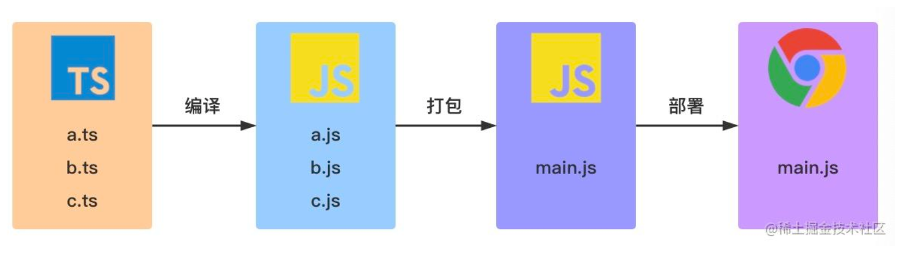
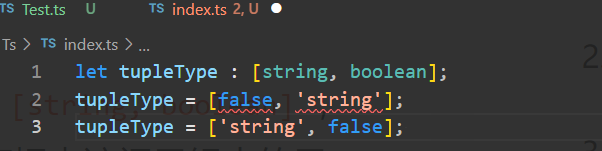

# TS

https://juejin.cn/post/6872111128135073806#heading-28

### Ts与Js的区别

TS 是 JS 的超集， 本质上向js这个语言上添加了 **可选的静态类型和基于类的面向对象编程**。TS 提供新的和不断发展的 JS 特性。

> 面向项目：
>
> TS ——面向大型项目，对架构设计及代码维护有很大的优势
>
> JS —— 脚本化语言，适用于简单场景且轻量化

> 自主检测：
>
> TS — 弱类型 ， 支持动态和静态类型检测
>
> JS — 弱类型，无静态类型选项

> 运行流程：
>
> TS — 依赖编译，通过编译打包生成浏览器可以运行的js
>
> JS —解释型语言，可以在浏览器中直接运行

> 复杂特性：
>
> TS — 模块化 泛型 接口.......

### 使用 TS

#### 1 安装

```
npm install -g typescript
```

#### 2 查看是否安装成功-

```
tsc -v
Version 4.0.2
```

#### 3 编译 Ts 文件

```
tsc helloworld.ts
```

#### TS 工作流程



**面试点： 优先级： 所有的类型检测和纠错 => 语法报错的优先级  （因为： 类型检测在编译时）**

### (Part 1)TS 基础类型写法 

- boolean , string ,number, array, null, undefined

  ```typescript
  // es
  let isEnabled = true;
  let class = 'zhaowa';
  let classNum = 2;
  let u = undefined;
  let n = null;
  let classArr = ['basic', 'execute'];
  
  // TS
  let isEnabled:boolean = true;
  let class:string = 'zhaowa';
  let classNum:number = 2;
  let u:undfined = undefined;
  let n:null = null;
  
  let classArr:string[] = ['basic', 'execute'];
  let classArr:Array<string> = ['basic', 'execute'];
  // => 原es数组中，多重类型的元素如何声明？
  ```

- tuple - 元组

   在元组初始化的时候如果类型不符合，会提示错误信息。

  

  ```typescript
  let tupleType: [string, boolean];
  tuple = ['zhaowa', false]
  ```

- enum - 枚举

```typescript
// 4.异构枚举
// 异构枚举的成员值是数字和字符串的混合
enum Score {
  ZERO,
  GOOD = 'GOODV',
  BAD = 'BADV',
  Five = 5,
  Six,
}

//  当value为数字时,可以根据数字找到 Key 若数字value在Enum类型中找不到， 返回undefined
//  当value为string时，不可以根据value 找key
console.log(Score[0]); // Zero
console.log(Score['GOOD']) // GOODV
console.log(Score['GOODV']) // undefind
console.log(Score[5]); // Five
console.log(Score[1]); // undefined
console.log(Score[6]) // Six


// 异构
    enmu Enum {
        A,  // 0
        B,  // 1
        C = 'C',
        D = 'D',
        E = 6,
        F,  // 7
    }
    // 面试题：指出每种枚举值的具体值 => 1. 找队伍 2. 确定特性
    // => js本质实现（手写实现异构枚举）
    let Enum;
    (function(Enum) {
        // 正向
        Enum['A'] = 0;
        Enum['B'] = 1;
        Enum['C'] = 'C';
        Enum['D'] = 'D';
        Enum['E'] = 6;
        Enum['F'] = 7;

        // 逆向
        Enum[0] = 'A';
        Enum[1] = 'B';
        Enum[6] = 'E';
        Enum[7] = 'F';
    })(Enum || (Enum = {}))
```

- any unknown void never

  ```ts
  //1 any - 绕过所有类型检查 =》 类型检测和编译筛查全部失效
  let anyValue: any = 123;
  anyValue = 'anyValue';
  anyValue = false;
  
  let value1: boolean = anyValue;
  // 2 unknown - 绕过赋值检查  =》 禁止更改传递
  let unknownValue: unknown;
  unknownVlaue = true;
  unknownVlaue = 123;
  unknownVlaue = 'string';
  
  let value1:unknown = unknownValue; // ok
  let value2:any = unknownValue; // ok
  let value3:string = unknownValue; // not ok
  
  // 3 void (与any相反: any是返回什么类型都可以，void是什么都不能返回) - 声明函数返回值
  function voidFunction(): void{
      console.log('no return')
  }
  // 4 never - 永不返回 or 永远error
  // never 类型表示的是那些永不存在的值的类型。 
  // 例如，never 类型是那些总是会抛出异常或根本就不会有返回值的函数表达式或箭头函数表达式的返回值类型。
  function error(msg: string): never{
      throw new Error(msg);
  }
  
  function longlongloop():never {
      while (true){
          // .......
      }
  }
  ```

**在 ts 中，可以利用never类型的特性来实现全面性检查**

```ts
type Foo = string | number;

function controlFlowAnalysisWithNever(foo: Foo) {
  if (typeof foo === "string") {
    // 这里 foo 被收窄为 string 类型
  } else if (typeof foo === "number") {
    // 这里 foo 被收窄为 number 类型
  } else {
    // foo 在这里是 never
    const check: never = foo;
  }
}
```

注意在 else 分支里面， 我们把收窄为never的foo 赋值给一个显示声明的 never 变量。如果一切逻辑正确， 那么编译就会通过，但是如果有一天你的同事修改了Foo的类型：

```ts
type Foo = string | number | boolean;
```

然而他忘记同时修改 `controlFlowAnalysisWithNever` 方法中的控制流程，这时候 else 分支的 foo 类型会被收窄为 `boolean` 类型，导致无法赋值给 never 类型，这时就会产生一个**编译错误**。通过这个方式，我们可以确保

`controlFlowAnalysisWithNever` 方法总是穷尽了 Foo 的所有可能类型。 通过这个示例，我们可以得出一个结论：**使用 never 避免出现新增了联合类型没有对应的实现，目的就是写出类型绝对安全的代码**

- object Object  {}

  **1 object 类型**

  是TS 2.2 引入的新类型。 用于表示 非原始类型。 

  除 string number boolean symbol null 或者 undefined之外的类型

  ```ts
  function create(o: object | null){
  
  }
  const test = {};
  create(test); // ok
  create(1); // // not ok
  create('string') // not ok
  create({a: 1}); // OK
  create(['1', '2', '3']) ;// ok 
  create(new Array([4,5, 6])) ;// ok
  create(undefined); // // not ok
  ```

  **2 Object 类型 **

  是所有Object类的实例的类型。 它是由以下两个接口来定义的。

  https://www.coolcou.com/typescript/typescript-type/typescript-object-type.html

  ```ts
  interface Object {
      // 构造函数的原型对象 中 有个 constructor属性，指向构造函数自身（------3）
      constructor: Function;
      toString(): string;
      toLocalString(): string;
      valueOf(): string;
      hasOwnProperty(v: PropertyKey): boolean;
      propertyIsEnumerable(v: PropertyKey): boolean;
  }
  
  // ObjectConstructor 接口定义了一些属性和方法，属性的类型是Object 或者方法的返回值 Object
  // node_modules/typescript/lib/lib.es5.d.ts
  interface ObjectConstructor {
    /** Invocation via `new` */
    new(value?: any): Object;
    /** Invocation via function calls */
    (value?: any): any;
     // 构造函数的类型 有个 只读的 prototype属性，这个属性的值是 Object 类型。（-------2）
    readonly prototype: Object;
    getPrototypeOf(o: any): any;
    // ···
  }
  // Object()构造函数的类型是 ObjectConstructor (--------1)
  declare var Object: ObjectConstructor;
  ```

  **Object 类的所有实例都继承了Object接口中的所有属性;**

  Object类型有一个特点，那就是除了`undefined`值和`null`值外，其他任何值都可以赋值给Object类型。

  **3 {}**

  {}类型描述了一个没有成员的对象

  ```
  // Type {}
  const obj = {};
  
  // "[object Object]"
  obj.toString();
  ```

  ### (Part 2 ) TS  interface

  ```ts
  interface Course {
      name: string;
      time: number;
  }
  let xmy:Course {
      name:'TS',
      time: 
  }
  // 只读 &任意
  interface Course {
      readonly name: string;
      time: number;
  }
  
  
  let arr: number[] = [1, 2, 3, 4];
  let ro: readonly number[] = [3,4,5];
  ro = arr; // number[] 赋值给 readonly number[] 可以
  console.log(ro); // [1,2,3,4] readonly number[] 不可以赋值给 number
  
  arr  = ro; // Error
   // arr1 = ro; The type 'readonly number[]' is 'readonly' and cannot be assigned to the mutable type 'number[]'
  
  ```

  ### (Part 3) 任意属性

  有时候我们希望一个接口中除了有必选和可选属性之外，允许有其他的任意属性，可以用索引签名的形式。

  ```ts
  //  任意属性
  interface Person{
      name: string;
      age?: number;
      [propName: string]:any;
  }
  
  const p1: Person = {
      name: 'xmy',
      // testPropName1: '124',
      '123': 123,
      'test': 'streewr'
      // testPropName3: Symbol('123'),
      // testBoolean: false,
  };
  ```

  ### (Part 4) 交叉类型

  在 TS中 交叉类型是将多个类型合并为一个类型。 通过 & 运算符

  ```ts
  // 合并
  
  /**
  在混入多个类型时，若存在相同的成员，且成员类型为非基本数据类型(如 D E F)，那么是可以成功合并
  **/
      interface A { x: D; }
      interface B { x: E; }
      interface C { x: F; }
  
      interface D { d: Boolean; }
      interface E { e: string; }
      interface F { f: number; }
  
      type ABC = A & B & C;
  
      let abc:ABC = {
          x: {
              d: false,
              e: 'class',
              f: 5
          }
      }
      // => 合并冲突
  
      interface A {
          c: string;
          d: string;
      }
  
      interface B {
          c: number;
          e: string
      }
  
      type AB = A & B;
  
      let ab:AB = {
          d: 'class',
          e: 'class'
      }
      // 合并关系是且 => c: never
  ```


## 断言

### 1  类型断言

通过类型断言这种方式可以告诉编译器，“相信我，我知道自己在干什么”。类型断言好比其他语言里的类型转换，但是不进行特殊的数据检查和解构。它没有运行时的影响，只是在编译阶段起作用。

有两种形式

**(1) 尖括号语法**

```ts
let someValue: any = 'this is a string';
let strLength: number = (<string>someValue).length;
```

**（2）as 语法**

```tsx
let someValue: any = 'this is a string';
let strLength: number = (someValue as string).length
```

### 2 非空断言

在上下文中，当类型检查器无法断定类型时，一个新的后缀表达式操作符 ！ 可以用于断言操作对象非 null 非 undefined 类型。**具体而言，x! 将从x值域中排除 null 和 undefined**

```ts
type NumGenerator = () => number;

function myFunc(numGenerator: NumGenerator | undefined) {
  // Object is possibly 'undefined'.(2532)
  // Cannot invoke an object which is possibly 'undefined'.(2722)
  const num1 = numGenerator(); // Error
  const num2 = numGenerator!(); //OK
}
```

非空断言操作符 ！ 会从编译生成的 JS 代码中移除，所以在实际使用的过程中，要注意。

```ts
const a: number | undefined = undefined;
const b: number = a!;
console.log(b) ;// undefined

// =====================================
"use strict"
const a = undefined;
const b = a;
console.log(b)

// 虽然在TS代码中使用了非空断言，使得 const b: number = a!; 可以通过TS类型检查器的检查，
//但是在生成的ES5代码中， 非空断言操作符被移除了，所以在浏览器中执行上面的代码，在控制台会输出undefined
```

### (3) 确定赋值断言

在 TS 2.7版本引入确定赋值断言，即允许在实例属性和变量声明后放置 ! 号，从而告知 TS 该属性会被明确赋值。

```ts
let x : number;
init();
// Variable 'x' is used before being assigned.(2454)
console.log(x * 2); // Error

function init(){
    x = 10;
}
```

```ts
// 通过 let x!: number; 确定赋值断言，TypeScript 编译器就会知道该属性会被明确地赋值。
let x!: number;
initialize();
console.log(2 * x); // Ok

function initialize() {
  x = 10;
}
```

## 类型守卫-

- 多态性-多重状态

- ```tsx
      // in - 定义属性场景下内容的确认
      interface Teacher {
          name: string,
          courses: string[];
      }
  
      interface Student {
          name: string,
          startTime: Date;
      }
  
      type Course = Teacher | Student;
  
      function startCourse(cls:Course) {
          if ('courses' in cls) {
              console.log('teacher');
          }
          if ('startTime' in cls) {
              console.log('student');
          }
      }
  
      // typeof / instanceof - 类型分类场景下的身份确认
      function class(name: string, score: string | number) {
          if (typeof score === 'number') {
              console.log('teacher');
          }
          if (typeof score === 'string') {
              console.log('student');
          }
      }
  
      function startCourse(cls:Course) {
          if (cls instanceof Teacher) {
              return cls.courses;
          }
          if (cls instanceof Student) {
              return cls.startTime;
          }
      }
  
      // 自定义类型
      const isTeacher = function(cls: Teacher | Student):cls is Teacher {
          return 'courses' in cls;
      }
  
      const getName = (cls: Teacher | Student) => {
          if (isTeacher(cls)) {
              return cls.courses;
          }
      }
  ```
