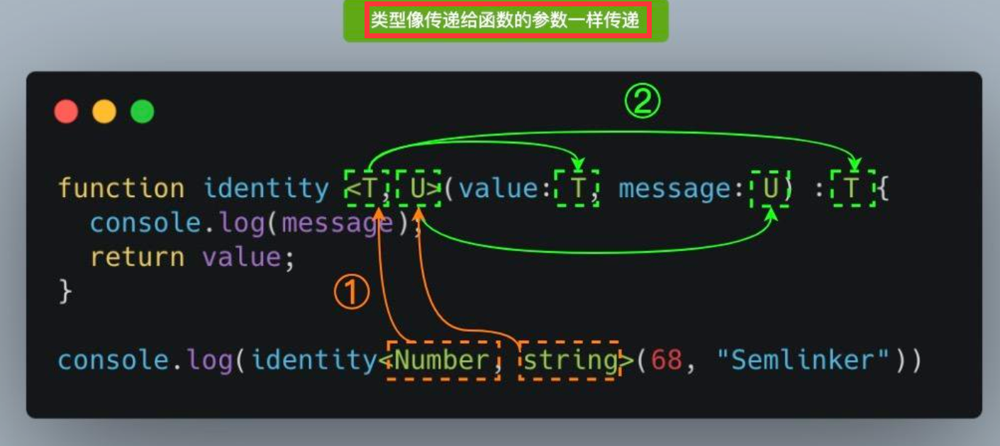

# TS 下

## 1 函数重载

**函数重载是 使用 同一函数名和不同参数类型或者不同参数个数 创建多个方法的一种能力。**

```ts
type Combinable = string | number; 

class Calculator {
  add(a: number, b: number): number;
  add(a: string, b: string): string;
  add(a: string, b: number): string;
  add(a: number, b: string): string;
  add(a: Combinable, b: Combinable) {
  if (typeof a === 'string' || typeof b === 'string') {
    return a.toString() + b.toString();
  }
    return a + b;
  }
}

const calculator = new Calculator();
const result = calculator.add('Semlinker', ' Kakuqo');
```

## 2 泛型

#### (1) 如何理解泛型？ ==> 让类型和值一样，可以传递和赋值， 让模块可以支持多种数据类型



```ts
function identity <T, U>(value: T, message: U) : T {
  console.log(message);
  return value;
}

console.log(identity(68, "Semlinker"));
```

#### (2) 泛型接口

```ts
interface GenericIdentityFn<T>{
    (arg: T): T
}
```

#### (3) 泛型类

```ts
class GenericNumber<T>{
    zeroValue: T; //类的属性
    add: (x:T, y: T) => T ;// 实例的方法
}

let myGenericNumber = new GenericNumber<number>();
myGenericNumber.zeroValue = 0;
myGenericNumber.add = function(x, y) {
    return x + y;
}
```

