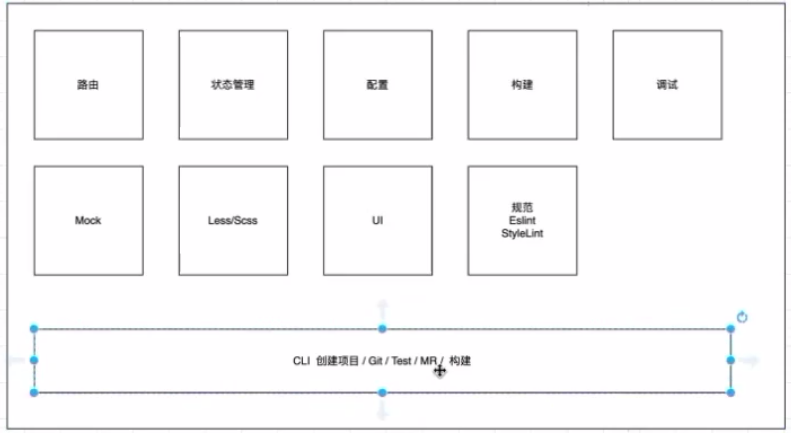

可能提到前端工程化，大家一般想到的是webpack配置相关，或者webpack性能调优，开发一个CLI的工具，其实这个是有点片面的。

## 前端工程化的基本概念

## 理解工程化的脚手架原理

## 理解工程化的技术选型

## 搭建基本的工程化流程

### 为什么会有前端工程化这个概念？

从前端的发展历史来解答。

最早期： html去写页面，css写样式，js写交互。最初js是没有模块化的概念，最多引入多个js脚本，没有模块隔离的概念。

NEXT: 模块化。----  后面发现js脚本太多，难以维护，因此出现了模块化。将js脚本按照模块进行拆分，AMD（异步加载模块） CMD （同步的模块加载）CommonJS （09年Node出现后）,ESModule

NEXT： 按照功能去拆，按照业务去拆模块，模块拆完之后放到哪个目录下面。这时候工程的思想逐步显现。

NEXT： 模块怎么去打包运行,早期用gulp grunt这些工具去

NEXT： 出现了前后端分离。前端可以独立的去开发了，前端需要承载的功能更多，也出现了SPA 单页面应用这些新的概念， 随着SPA的出现，也出现了一些前端框架。这时候前端要考虑的事情就比较多了。因为前端已经变成了一个独立的应用， 在开发阶段要考虑 比如路由设计， 开发时如何调试，开发完怎么去构建，构建完怎么去发布。

这一切的东西才构成前端工程化这个概念，而不只是webpack babel 如何构建这一块，而是一个整体。从代码开发开始，到怎么构建，怎么发布测试，怎么上线，上线后的应用状态怎么去 监控，这一套流程，才能称之为前端工程化。

**创建一个新项目**

step1 : 创建项目

step2: 开发

step3: 构建 持续集成 / 持续部署

step4 : 测试 持续集成 / 持续部署

step5:上线 持续集成 / 持续部署

step6:上线后去**监控**应用

#### 从UMIJS来了解工程化

#### 配置 路由 MOCK 命令行工具  构建 测试 部署  等等

### 服务器分类

#### 1.1 应用服务器

**专注于 动态资源，解析高级开发语言编写的代码。前端服务一般是基于js语言的nodejs搭建**

#### 1.2 网关服务器

**专注于静态资源，代理转发，负载均衡等**

Nginx 等

### CI

**Continuous Integration 持续集成**

软件在开发过程中，需要**不断的**提交，合并进行单元测试和发布测试版本等等，这一过程是痛苦的。

**持续集成 CI 是在源代码变更后自动检测、拉取、构建的过程。**

### CD

**Continuous Delivery 持续交付**

从前端的角度考虑，在某些情况下肯定是不能直接通过自动化的方式将最终build的结果直接扔到生产机的。

持续交付就是可持续性交付供生产使用的最终build。最后通过运维或者后端进行部署。

**Continuous Deployment 持续部署**

作为 持续交付 的延伸，持续部署 可以**自动**将应用发布到生产环境。

#### 面试题：：：：

**一个新的项目由你来做技术选型，你会从哪几个方面来考虑？**

看你对前端项目流程了解到一个什么程度，对前端工程化的设计

从公司人员更熟悉哪种框架来确定用啥框架，然后在路由设计方面，根据项目的模块来设计。mock数据，在开发过程中的本地调试，调试工具 比如webpack 的 devServer, 除此之外，ssr（服务端渲染） 这些都是在开发阶段需要考虑的问题。

**前端项目应该如何部署上线？**

**什么是CDN？简述CDN的优点**

**如何设计一个脚手架工具？**

