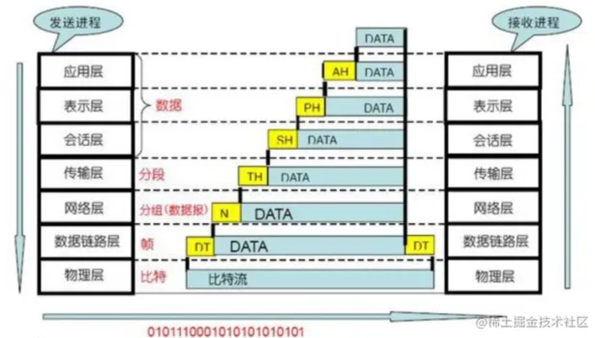
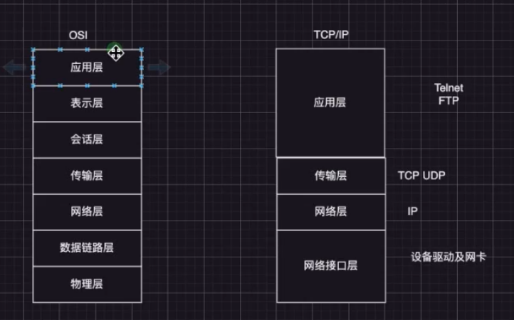

## OSI TCP/IP 计算机网络的模型设计

### OSI open system interconnection 

**1 物理层**

**2 数据链路层 data link layer**

接受物理层的数据，封装成帧， 转发上层数据解析的内容发给物理层

物理层上有差错的数据 -> 无差错的数据帧

**3 网络层 network layer**

IP  ICMP

通过路由选择算法，将报文通过线路传输给指定的结点，选择最合适的路径

**4 传输层 transport layer**

TCP UDP

进行端对端的有差错控制， 流量控制，保证报文准确性

**5 会话层 session layer**

两个真是实体建立链接和使用的过程

**6 表示层 presentation layer**

承上启下 将第七层的数据解析格式，传输给会话层

**7 应用层**

### TCP IP 模型

https://www.yuque.com/lpldplws/web/sh97a9ok4ed3whup?singleDoc# 《Node框架详解》 密码：uur9

<https://www.yuque.com/lpldplws/web/remygq?singleDoc># 《Node实战》 密码：hl1r

<https://www.yuque.com/lpldplws/web/gqimym?singleDoc># 《Node.js 网络HTTP & 部署》 密码：osbv

<https://www.yuque.com/lpldplws/web/dxeix9g7n8n6x8no?singleDoc># 《HTTPS汇总》 密码：knmx