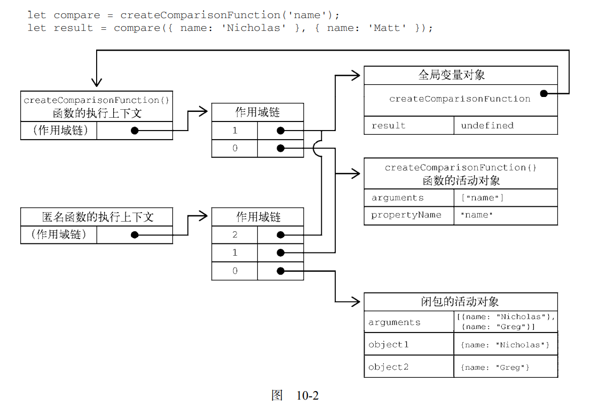
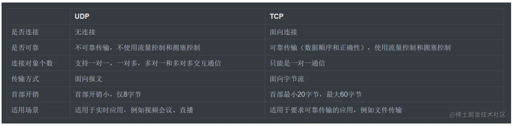
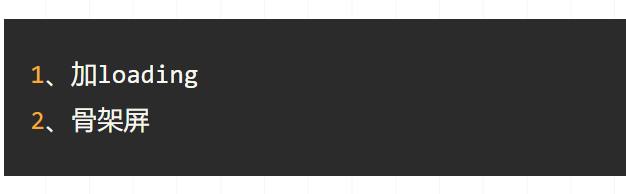

# JS 

### 1 什么是防抖和节流？有什么区别，怎么实现？

防抖是用户在多次快速点击的情况下，只在最后一次点击后做出响应。其实是这样的，会设置一个时间延迟t，如果在时间延迟之内用户再次点击，则将从0开始再延迟t，直到点击后，在延迟时间t之内未进行再次点击，则会做出响应。在搜索功能中用的较多。每次触发延时时间都会取消之前的延时调用方法

节流：多次点击，但是在N秒内只会执行一次。所以节流会稀释函数的执行频率

```js
防抖：
function debounce(fn, time) {
    let timeout = null;
    return function() {
        clearTimeout(timeout);
        timeout =  setTimeout(() =>{
            fn.apply(this,arguments)
        }, time)
    }
}
```

### 2 New 操作符做了什么事情

new 后面跟一个构造函数，创建该构造函数的一个实例对象。

> 1 首先创建该构造函数的实例对象
>
> 2 设置该实例对象的原型为 该构造函数的 prototype对象
>
> ```js
> function A() {
> 	
> }
> const a = new A();
> console.log(a.__proto__ === A.prototype); // true
> ```
>
> 3 让构造函数中的 this 指向这个对象， 执行构造函数的代码（为这个新对象添加属性）
>
> ```js
> function A(nick, age) {
>   this.nick = nick;
>   this.age = age;
> }
> 
> const a = new A('nick', 18);
> console.log(a); // A { nick: 'nick', age: 18 }
> console.log(a.__proto__ === A.prototype); // true
> ```
>
> 4 判断函数的返回值类型 ，如果是值类型或者没有返回值，则返回创建的对象；如果是引用类型，则返回引用类型的对象。

### 3 什么是闭包，闭包的作用是什么，怎么形成的

一个函数的返回值是个函数，并且被返回的函数内部有引用到外部函数的变量，并且被返回的函数在别处被调用，这就造成被引用的外部函数中的变量无法被回收， 形成了一个闭包。

闭包指的是那些引用了另一个函数作用域中的变量的函数。通常是在嵌套代码中实现的。

闭包中的变量会被长久的保存并且不会造成全局变量污染。

提到闭包不得不和上下文以及作用域链联系起来。

**一般函数**

**在函数执行时**，每个**执行上下文**都会有一个包含其中变量的对象。在**全局上下文**中叫变量对象（VO）。它会在代码执行期间始终存在。

而**函数局部上下文**中的叫活动对象（VO）， 只会在**函数执行期间**存在。

在全局作用域中，定义一个函数C的时候，就会为他创建作用域链，预装载**全局变量对象（VO）**，并保存在内部的[[scope]]中。

接着在调用这个函数C的时候：

​	就会创建相应的执行上下文，然后通过复制函数的[[scope]]来创建其作用域链。

​	接着会创建该函数的活动对象（AO）并将其推入作用域链的前端。 

​	---此时，C函数执行上下文的作用域链中就有两个变量对象： 活动对象用作**局部变量对象**以及**全局变量对象**

 **作用域链其实是一个包含指针的列表**，每个指针分别指向 一个变量对象，但是物理上不会包含相应的对象。

函数内部的代码在访问变量时，就会使用给定的名称从作用域链中查找该变量。

函数执行完毕后，局部活动对象会被销毁，内存中就只剩下全局作用域。这是一般函数执行流程。

**不过闭包就不一样了**

在一个函数内部定义的函数，会将其包含函数的活动对象添加到自己的作用域链中。

```js
 
function Outer（） {
	let a = '123';
	return function() {
        let b = a +  'pending';
        return b
	}
}

const innerF = Outer();
//1 定义 function Outer 是会为其创建一个作用域链，预装载全局变量对象（VO），[[scope]] :{ VO };
//2  会创建函数执行上下文 ，并将复制[[scope]]
//3  创建活动对象 AO {a} 到作用域链前端 ： (outer的)VO ——> AO 
//4  在活动对象 AO 中有一个 匿名function, 在定义阶段， 创建匿名函数的 作用域链 (outer的)VO ——> AO 
innerF();
//5 在调用匿名函数时， 将创建匿名函数的上下文， 及作用域链，并将匿名函数的活动对象添加到作用域链的前端： （inner的）VO ——> (outer的)VO ——> Ao 
```

```js
function createComparisonFunction(propertyName) {
 return function(object1, object2) {
 let value1 = object1[propertyName];
 let value2 = object2[propertyName];
 if (value1 < value2) {
 return -1;
 } else if (value1 > value2) {
 return 1;
 } else {
 return 0;
 }
 };
}

let compare = createComparisonFunction('name');
let result = compare({ name: 'Nicholas' }, { name: 'Matt' }); 

```



**外部函数的活动对象并不能在它执行完毕后销毁，因为匿名函数中仍然有对它的引用**

在creatComparaisonFunction()执行完毕后，**其执行上下文的作用域链会被销毁，但是它的活动对象仍然会被保存在内存中， 直到匿名函数被销毁后才会被销毁。**

```
// 解除对函数的引用，这样就可以释放内存了
compareNames = null;
```

如上，匿名函数的作用域链会被销毁，其他作用域（除全局作用域之外）也可以销毁。（闭包保存的是外部函数的作用域）

### 4 Promise 

promise 是异步编程的一种解决方案。promise是个对象，他可以获取异步操作的消息。有三种状态： pending fulfilled rejected 。状态只能从pending 到 fulfilled或者从pending到 rejected  。

### 5  客户端存储 cookie localStorage SessionStorage

**Web Storage 定义了两个对象用于存储数据：sessionStorage 和 localStorage。前者用于严格
保存浏览器一次会话期间的数据，因为数据会在浏览器关闭时被删除。后者用于会话之外持久保存数据。**

#### cookie 

随着web 应用程序的出现，直接在客户端上存储用户信息的需求也有了。

> cookie 最初用于在客户端存储会话信息。
>
> - 服务端设置cookie： 服务器在响应http请求时， 在 响应头部添加一个Set-Cookie ： name= value;
>
> ​	浏览器会存储这些会话信息，并在发送请求时在请求头中带上。
>
> - cookie与特定域绑定。设置cookie后，会与请求一起发送到创建它的域。不会被其他域访问。
> -  大多数浏览器对cookie的限制是4KB （1B = 8bit, 1KB = 1024B, 1MB = 1024KB）
> - 构成： 名称，值， 域，路径，过期时间，安全标志。

```
HTTP/1.1 200 OK
Content-type: text/html
Set-Cookie: name=value; expires=Mon, 22-Jan-07 07:10:24 GMT; domain=.wrox.com
```

要知道，域、路径、过期时间和 secure 标志用于告诉浏览器什么情况下应该在请求中包含 cookie。
这些参数并不会随请求发送给服务器，实际发送的只有 cookie 的名/值对。

在 JavaScript 中处理 cookie 比较麻烦，因为接口过于简单，只有 BOM 的 document.cookie 属性。

所以可以通过辅助函数来简化相应的操作。与 cookie 相关的基本操作有读、写和删除。

没有直接删除cookie的方法，可以将cookie的日期设置为new Date(0)， 将过期时间设置为1970.1.1。

> 还有一种叫做 HTTP-only 的cookie; HTTP-only 可以在浏览器设置，也可以在服务器设置。但是只能在服务器上读取。JS无法获取这种cookie值。
>
> 因为所有cookie都会作为请求头部由浏览器发送给服务器，所以在cookie中保存大量信息可能会影响特定域浏览器请求的性能。不要在cookie中存储敏感信息。

#### Storage

Storage类型用于保存 名/值 对数据，直至存储空间上限（由浏览器决定）

只能存储字符串类型。

Storage 的实例与其他对象一样。但是增加了一下方法：

- clear()  删除所有值，不在Firefox中实现。
- getItem(name): 取得给定name的值
- setItem(name, value)  设置给定name的值
- key(Index) 取得给定数值位置的名称
- removeItem(name) 删除给定name 的名值对

因为每个数据项都是作为属性存在该对象上的，因此可以通过点或者方括号操作符来访问这些属性，

通过同样的操作去设置值，也可以使用delete 操作符去删除属性，但是不推荐。

通过length属性确定Storage对象中保存了多少名/值对。

**sessionStorage**

- **sessionStorage 对象 只存储会话数据。这意味着数据只会存储到浏览器关闭。**跟浏览器关闭时会消失的会话cookie 相似。存储在 SessionStorage 中的数据不受页面刷新的影响，可以在浏览器崩溃后恢复（受浏览器影响）
- 通过 WebStorage 写入的任何数据都可以立即被读取。因为这个是同步阻塞的写入方式。

**localStorage**

作为客户端持久存储数据的机制。

要访问同一个localStorage的对象，则页面必须来自同一个域（子域不可以）、在相同的端口上使用相同的协议。

因为 localStorage 是 Storage 的实例，所以可以像使用 sessionStorage 一样使用 localStorage.

##### 区别：

> 存储在 localStorage 中的数据会保留到通过JS删除或者用户清除浏览器缓存。localStorage 数据不受页面刷新的影响，也不会因为关闭窗口、标签页、或者重启浏览器而丢失。

### 6 在地址栏中输入一个回车会发生哪些事情？

> 1、解析URL：首先会对 URL 进行解析，分析所需要使用的传输协议和请求的资源的路径。如果输入的 URL 		中的协议或者主机名不合法，将会把地址栏中输入的内容传递给搜索引擎。如果没有问题，浏览器会检查 	URL 中是否出现了非法字符，如果存在非法字符，则对非法字符进行转义后再进行下一过程。
>
> 2、缓存判断：浏览器会判断所请求的资源是否在缓存里，如果请求的资源在缓存里并且没有失效，那么就直接使用，否则向服务器发起新的请求。
>
> 3、DNS解析： 下一步首先需要获取的是输入的 URL 中的域名的 IP 地址，首先会判断本地是否有该域名的 IP  地址的缓存，如果有则使用，如果没有则向本地 DNS 服务器发起请求。本地 DNS 服务器也会先检查是否存在缓存，如果没有就会先向根域名服务器发起请求，获得负责的顶级域名服务器的地址后，再向顶级域名服务器请求，然后获得负责的权威域名服务器的地址后，再向权威域名服务器发起请求，最终获得域名的 IP 地址后，本地 DNS 服务器再将这个 IP 地址返回给请求的用户。用户向本地 DNS 服务器发起请求属于递归请求，本地 DNS 服务器向各级域名服务器发起请求属于迭代请求。
>
> 4、获取MAC地址： 当浏览器得到 IP 地址后，数据传输还需要知道目的主机 MAC 地址，因为应用层下发数据给传输层，TCP 协议会指定源端口号和目的端口号，然后下发给网络层。网络层会将本机地址作为源地址，获取的 IP 地址作为目的地址。然后将下发给数据链路层，数据链路层的发送需要加入通信双方的 MAC 地址，本机的 MAC 地址作为源 MAC 地址，目的 MAC 地址需要分情况处理。通过将 IP 地址与本机的子网掩码相与，可以判断是否与请求主机在同一个子网里，如果在同一个子网里，可以使用 APR 协议获取到目的主机的 MAC 地址，如果不在一个子网里，那么请求应该转发给网关，由它代为转发，此时同样可以通过 ARP 协议来获取网关的 MAC 地址，此时目的主机的 MAC 地址应该为网关的地址。
>
> 5、TCP三次握手： 下面是 TCP 建立连接的三次握手的过程，首先客户端向服务器发送一个 SYN 连接请求报文段和一个随机序号，服务端接收到请求后向客户端发送一个 SYN ACK报文段，确认连接请求，并且也向客户端发送一个随机序号。客户端接收服务器的确认应答后，进入连接建立的状态，同时向服务器也发送一个ACK 确认报文段，服务器端接收到确认后，也进入连接建立状态，此时双方的连接就建立起来了。
>
> 6、HTTPS握手： 如果使用的是 HTTPS 协议，在通信前还存在 TLS 的一个四次握手的过程。首先由客户端向服务器端发送使用的协议的版本号、一个随机数和可以使用的加密方法。服务器端收到后，确认加密的方法，也向客户端发送一个随机数和自己的数字证书。客户端收到后，首先检查数字证书是否有效，如果有效，则再生成一个随机数，并使用证书中的公钥对随机数加密，然后发送给服务器端，并且还会提供一个前面所有内容的 hash 值供服务器端检验。服务器端接收后，使用自己的私钥对数据解密，同时向客户端发送一个前面所有内容的 hash 值供客户端检验。这个时候双方都有了三个随机数，按照之前所约定的加密方法，使用这三个随机数生成一把秘钥，以后双方通信前，就使用这个秘钥对数据进行加密后再传输。
>
> 7、返回数据： 当页面请求发送到服务器端后，服务器端会返回一个 html 文件作为响应，浏览器接收到响应后，开始对 html 文件进行解析，开始页面的渲染过程。
>
> 8、页面渲染： 浏览器首先会根据 html 文件构建 DOM 树，根据解析到的 css 文件构建 CSSOM 树，如果遇到 script 标签，则判断是否含有 defer 或者 async 属性，要不然 script 的加载和执行会造成页面的渲染的阻塞。当 DOM 树和 CSSOM 树建立好后，根据它们来构建渲染树。渲染树构建好后，会根据渲染树来进行布局。布局完成后，最后使用浏览器的 UI 接口对页面进行绘制。这个时候整个页面就显示出来了。
>
> 9、TCP四次挥手： 最后一步是 TCP 断开连接的四次挥手过程。若客户端认为数据发送完成，则它需要向服务端发送连接释放请求。服务端收到连接释放请求后，会告诉应用层要释放 TCP 链接。然后会发送 ACK 包，并进入 CLOSE_WAIT 状态，此时表明客户端到服务端的连接已经释放，不再接收客户端发的数据了。但是因为 TCP 连接是双向的，所以服务端仍旧可以发送数据给客户端。服务端如果此时还有没发完的数据会继续发送，完毕后会向客户端发送连接释放请求，然后服务端便进入 LAST-ACK 状态。客户端收到释放请求后，向服务端发送确认应答，此时客户端进入 TIME-WAIT 状态。该状态会持续 2MSL（最大段生存期，指报文段在网络中生存的时间，超时会被抛弃） 时间，若该时间段内没有服务端的重发请求的话，就进入 CLOSED 状态。当服务端收到确认应答后，也便进入 CLOSED 状态。

### 7 UDP和TCP有什么区别



### 8 七层模型 五层模型

### 9 怎么解决白屏问题



### 10 哪些情况会导致内存泄露

1、意外的全局变量：由于使用未声明的变量,而意外的创建了一个全局变量,而使这个变量一直留在内存中无法被		回收

 2、被遗忘的计时器或回调函数：设置了 setInterval 定时器，而忘记取消它，如果循环函数有对外部变量的引用的话，那么这个变量会被一直留在内存中，而无法被回收。

 3、脱离 DOM 的引用：获取一个 DOM 元素的引用，而后面这个元素被删除，由于一直保留了对这个元素的引用，所以它也无法被回收。 

4、闭包：不合理的使用闭包，从而导致某些变量一直被留在内存当中。

### 11 说一下 HTTP 和HTTPS 协议的区别

1、HTTPS协议需要CA证书,费用较高;而HTTP协议不需要
2、HTTP协议是超文本传输协议,信息是明文传输的,HTTPS则是具有安全性的SSL加密传输协议;
3、使用不同的连接方式,端口也不同,HTTP协议端口是80,HTTPS协议端口是443;
4、HTTP协议连接很简单,是无状态的;HTTPS协议是具有SSL和HTTP协议构建的可进行加密传输、身份认证的网络协议,比HTTP更加安全

### 12 常见的 HTTP 状态码

```js
    <!-- 状态码：由3位数字组成，第一个数字定义了响应的类别 -->
    <!-- 1xx：指示消息,表示请求已接收，继续处理 -->
    <!-- 2xx：成功,表示请求已被成功接收，处理 -->
    <!-- 200 OK：客户端请求成功
         204 No Content：无内容。服务器成功处理，但未返回内容。一般用在只是客户端向服务器发送信息，而服务器不用向客户端返回什么信息的情况。不会刷新页面。
         206 Partial Content：服务器已经完成了部分GET请求（客户端进行了范围请求）。响应报文中包含Content-Range指定范围的实体内容
 -->
    <!-- 3xx 重定向 -->
    <!-- 301 Moved Permanently：永久重定向，表示请求的资源已经永久的搬到了其他位置。
         302 Found：临时重定向，表示请求的资源临时搬到了其他位置
         303 See Other：临时重定向，应使用GET定向获取请求资源。303功能与302一样，区别只是303明确客户端应该使用GET访问
         307 Temporary Redirect：临时重定向，和302有着相同含义。POST不会变成GET
         304 Not Modified：表示客户端发送附带条件的请求（GET方法请求报文中的IF…）时，条件不满足。返回304时，不包含任何响应主体。虽然304被划分在3XX，但和重定向一毛钱关系都没有
 -->
    <!-- 4xx：客户端错误 -->
    <!-- 400 Bad Request：客户端请求有语法错误，服务器无法理解。
         401 Unauthorized：请求未经授权，这个状态代码必须和WWW-Authenticate报头域一起使用。
         403 Forbidden：服务器收到请求，但是拒绝提供服务
         404 Not Found：请求资源不存在。比如，输入了错误的url
         415 Unsupported media type：不支持的媒体类型
 -->
    <!-- 5xx：服务器端错误，服务器未能实现合法的请求。 -->
    <!-- 500 Internal Server Error：服务器发生不可预期的错误。
         503 Server Unavailable：服务器当前不能处理客户端的请求，一段时间后可能恢复正常，
 -->
```


### Set Map WeakSet WeakMap

#### Set

> Set 是一个集合，也是一个构造函数，可以通过new 关键字创建实例， 参数为一个可迭代对象
>
> keys() 返回一个包含集合中所有数据键的迭代器，
>
> values() 返回一个包含集合中所有值的迭代器，
>
> entries() 返回一个包含 Set 对象中所有元素的键值对迭代器。
>
> set 对象可以用 ... 运算符
>
> 操作方法： add delete  has clear
>
> 遍历方法： keys values entries forEach  (WeakSet 没有遍历方法下面会提到)

```js
const s1 = new Set({ 1: '1', 2: "2", 3: '3' }); // object is not iterable
const s = new Set([{ a: 12 }, 34, '34', 'xmy']);
console.log(s); // Set(4) { { a: 12 }, 34, '34', 'xmy' }
console.log(s.keys()); // [Set Iterator] { { a: 12 }, 34, '34', 'xmy' }
console.log(s.values()); // [Set Iterator] { { a: 12 }, 34, '34', 'xmy' }
/**
 * [Set Entries] {
    [ { a: 12 }, { a: 12 } ],
    [ 34, 34 ],
    [ '34', '34' ],
    [ 'xmy', 'xmy' ]
  }
 * **/
console.log(s.entries());
console.log([...s]); // [ { a: 12 }, 34, '34', 'xmy' ]
console.log(...s); //  { a: 12 }, 34, '34', 'xmy' 
```

> 向 set 中加入数据的时候，不会发生类型转化。Set内部判断两个值是否相等，使用的算法类似于精确相等运算符，主要的区别是 NaN 等于自身，精确相等运算符认为 NaN 不等于自身。

```js
console.log(NaN === NaN); // false
const s1 = new Set();
s1.add(NaN);
s1.add(NaN);
console.log(s1); // Set(1) { NaN }
```

> Set 可默认遍历。默认迭代器生成函数是values方法
>
> ```js
> Set.protorype[Symbol.iterator] === Set.prototype.values; // true
> ```
>
> 因此，Set 可使用 map filter 方法。

```js
let s2 = new Set([1, 2, 3]);
s2 = new Set([...s2].map(item => item * 2));
console.log([...s2]);// [2,4,6]
```

#### WeakSet

> 与 Set 的区别： 
>
> - WeakSet 只能存储对象引用，而不能存储值； 而Set 都可以。
> - WeakSet 是弱引用，即垃圾回收机制不考虑 WeakSet中的对象引用，如果没有其他变量或属性引用该对象，这个对象就会被回收，而不会考虑在WeakSet对象中还有没有该对象引用。
> - WeakSet 对象是无法被遍历的，（ES6规定 WeakSet 不可遍历），也没有办法拿到它所包含的所有元素。

#### Map 

> 集合 与 字典 的区别：
>
> - 共同点： 集合 字典可以 存储不重复的值。
> - 不同点： 集合是以[value,value] 的形式存储元素。 字典是以 [key, value]的形式存储。key 可以为对象，是对象引用。（对象存储在堆内存中，保存对象的变量其值为对象引用也就是指针，指针和基础值一样保存在栈内存中，指向该对象在堆内存中的位置）

```js
const m = new Map();
const o = { p: 'haha' };
console.log(m.set(o, 'content')); // Map(1) { { p: 'haha' } => 'content' }
console.log(m.get(o)); // content

o.p = 'changed';
console.log(m.keys()); // [Map Iterator] { { p: 'changed' } }

console.log(m.has(o)); // true
m.delete(o);
console.log(m.has(o));  // false
```

> **任何具有 Iterator 接口，且每个成员都是一个双 元素的数组的 数据结构都可以当做 Map 构造函数的参数**
>
> 如果读取一个未知的键，则返回 undefined

```js
const s3 = new Set([['key1', 'value1'], ['key2', 'value2']]);
const m1 = new Map(s3);
console.log(m1.get('key1')); // value1

const m2 = new Map([['baz', 301]]);
console.log(m2.get('baz')); // 301
const m3 = new Map(m2);
console.log(m3.get('baz')); //301
console.log(m3.get('bazz')); //undefined
```

> 注意： 只有对同一个对象的引用，Map 结构才将其视为同一个键。这一点要小心。(上面不同点括号里内容)

```js
const m4 = new Map();
m2.set(['a'], '555');
console.log(m2.get(['a'])); // undefined
// 因为 内存地址不同
---------------------------------------------
const m4 = new Map();
const b = ['a'];
m2.set(b, '555');
console.log(m2.get(b)); // 555

```

> Map 的属性及方法
>
> 属性： 
>
> - constructor 构造函数
> - size 返回字典中包含元素的个数
>
> 操作方法：
>
> - set(key,value)
> - get(key)
> - has(key)
> - delete(key)
> - clear()
>
> 遍历方法：
>
> - keys
> - values
> - forEach
> - entries

#### WeakMap

**WeakMap 对象是一组键值对的集合， 其中的键是弱引用，值可以任意。**注意：弱引用的只是键名，键值依然是正常引用。

> WeakMap 中，每个键对自己所引用对象的引用都是弱引用，在没有其他引用和该键引用同一对象，则这个对象会被垃圾回收（相应的key则变成无效的），所以，WeakMap的key是不可枚举的。
>
> 属性： constructor 方法： set get has delet

### 总结：

- #### set

  - 成员唯一，无序， 且不重复。
  - [value,value] 键值与键名 是一致的。（或者说只有键值，没有键名）
  - 可以遍历。方法上面有。

- WeakSet

  - 成员都是对象的弱引用。可以被垃圾回收机制回收。可以用来保存DOM节点，不容易造成内存泄露。
  - 不能遍历，方法上面有。

- Map

  - 本质上是键值对的集合，类似集合
  - 可以遍历，方法很多可以跟各种数据格式转换。

- WeakMap

  - 只接受对象作为键名， （null 除外）, 不接受其他类型的值作为键名
  - 键名是弱引用，键值可以是任意的。键名所指向的对象可以被垃圾回收，此时键名是无效的。
  - 不能遍历，方法有 get set has delete 


my: new后面跟一个构造函数，创建一个构造函数的实例对象，该实例对象可调用构造函数中返回的属性和方法